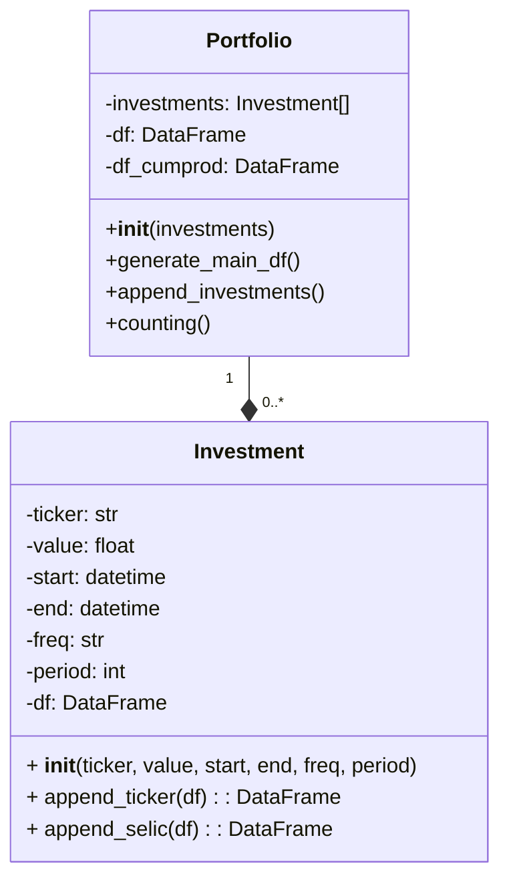
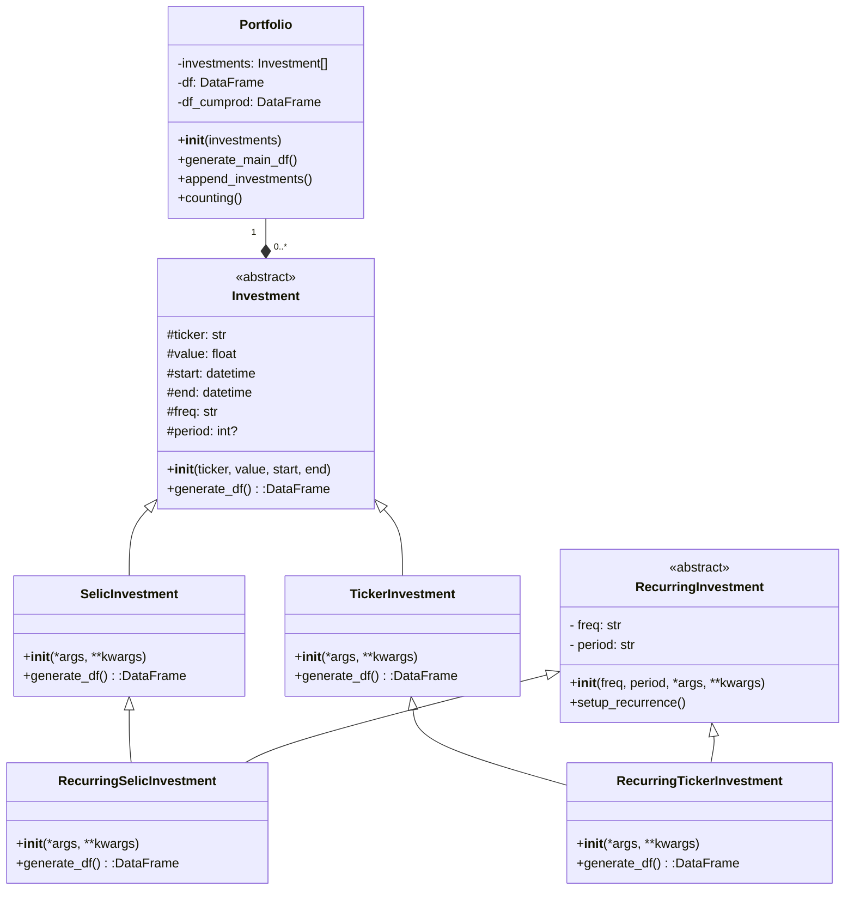
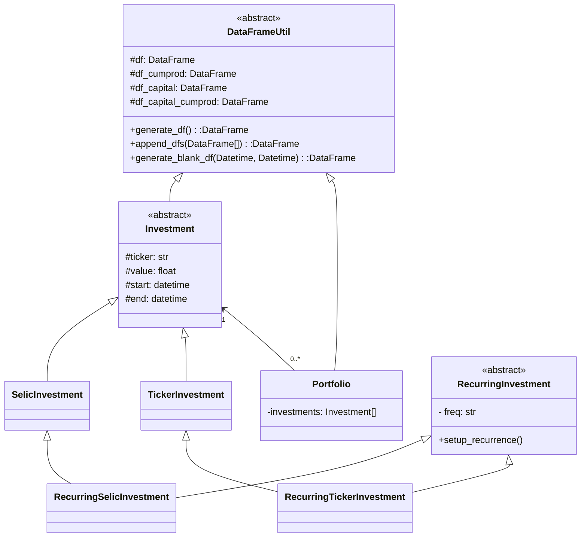
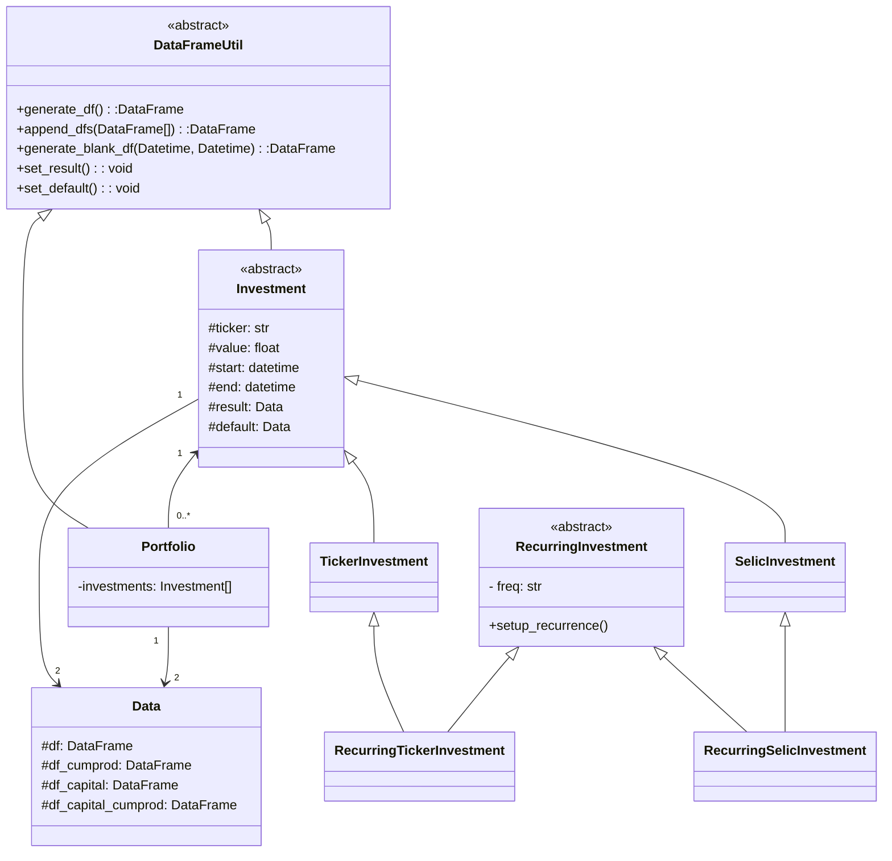
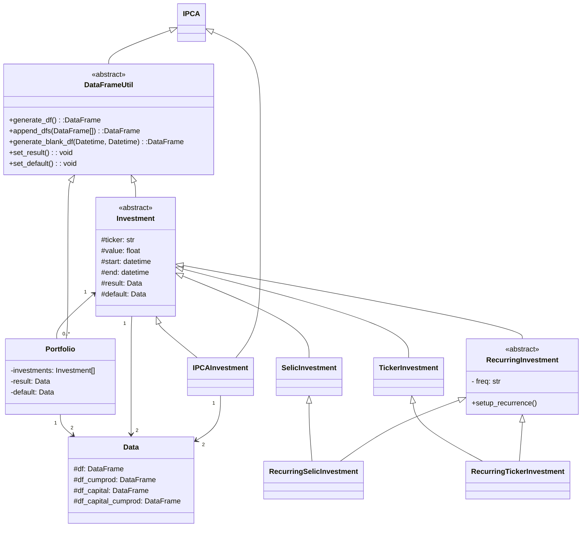
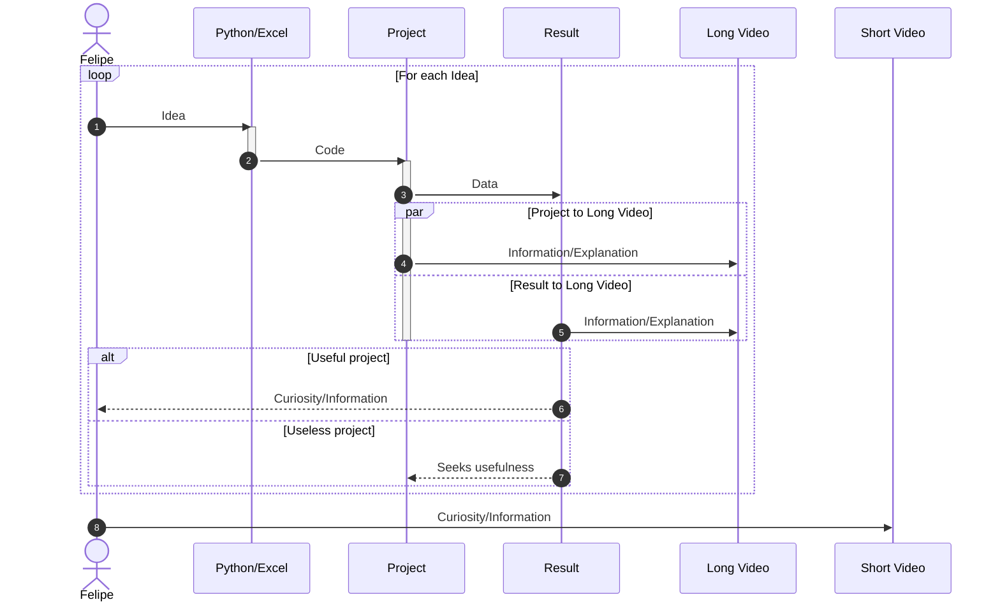

## UML
### Initial UML

```mermaid
classDiagram

  class Investment{
    -ticker: str
    -value: float
    -start: datetime
    -end: datetime
    -freq: str
    -period: int
    -df: DataFrame
    + __init__(ticker, value, start, end, freq, period)
    + append_ticker(df): DataFrame
    + append_selic(df): DataFrame
  }

  class Portfolio{
    -investments: Investment[]
    -df: DataFrame
    -df_cumprod: DataFrame
    +__init__(investments)
    +generate_main_df()
    +append_investments()
    +counting()
  }

    Portfolio "1" --* "0..*" Investment

```

### UML v1.2

```mermaid
classDiagram

  class Portfolio{
    -investments: Investment[]
    -df: DataFrame
    -df_cumprod: DataFrame
    +__init__(investments)
    +generate_main_df()
    +append_investments()
    +counting()
  }

    class Investment{
        <<abstract>>
        #ticker: str
        #value: float
        #start: datetime
        #end: datetime
        #freq: str
        #period: int?
        +__init__(ticker, value, start, end)
        +generate_df():DataFrame
    }
    class SelicInvestment{
        +__init__(*args, **kwargs)
        +generate_df():DataFrame

    }
    class TickerInvestment{
        +__init__(*args, **kwargs)
        +generate_df():DataFrame
    }
    class RecurringInvestment{
        <<abstract>>
        - freq: str
        - period: str
        +__init__(freq, period, *args, **kwargs)
        +setup_recurrence()
    }
    class RecurringSelicInvestment{
        +__init__(*args, **kwargs)
        +generate_df():DataFrame
    }
    class RecurringTickerInvestment{
        +__init__(*args, **kwargs)
        +generate_df():DataFrame
    }

    Investment <|-- SelicInvestment
    Investment <|-- TickerInvestment
    SelicInvestment <|-- RecurringSelicInvestment
    TickerInvestment <|-- RecurringTickerInvestment
    RecurringInvestment <|-- RecurringSelicInvestment
    RecurringInvestment <|-- RecurringTickerInvestment
    Portfolio "1" --* "0..*" Investment
```

### UML v1.3

```mermaid
classDiagram

  class Portfolio{
    -investments: Investment[]
  }

  class Investment{
      <<abstract>>
      #ticker: str
      #value: float
      #start: datetime
      #end: datetime
  }

  class SelicInvestment{
  }

  class TickerInvestment{
  }

  class RecurringInvestment{
      <<abstract>>
      - freq: str
      +setup_recurrence()
  }
  class RecurringSelicInvestment{
  }
  class RecurringTickerInvestment{
  }

  class DataFrameUtil{
    <<abstract>>
    #df: DataFrame
    #df_cumprod: DataFrame
    #df_capital: DataFrame
    #df_capital_cumprod: DataFrame
    +generate_df():DataFrame
    +append_dfs(DataFrame[]):DataFrame
    +generate_blank_df(Datetime, Datetime):DataFrame
  }

  Investment <|-- SelicInvestment
  Investment <|-- TickerInvestment
  SelicInvestment <|-- RecurringSelicInvestment
  TickerInvestment <|-- RecurringTickerInvestment
  RecurringInvestment <|-- RecurringSelicInvestment
  RecurringInvestment <|-- RecurringTickerInvestment

  Investment "1" <-- "0..*" Portfolio
  
  DataFrameUtil <|-- Investment
  DataFrameUtil <|-- Portfolio
```

### UML v1.4

```mermaid
classDiagram

  class Data {
    #df: DataFrame
    #df_cumprod: DataFrame
    #df_capital: DataFrame
    #df_capital_cumprod: DataFrame
  }

  class Portfolio{
    -investments: Investment[]
  }

  class Investment{
      <<abstract>>
      #ticker: str
      #value: float
      #start: datetime
      #end: datetime
      #result: Data
      #default: Data
  }

  class SelicInvestment{
  }

  class TickerInvestment{
  }

  class RecurringInvestment{
      <<abstract>>
      - freq: str
      +setup_recurrence()
  }
  class RecurringSelicInvestment{
  }
  class RecurringTickerInvestment{
  }

  class DataFrameUtil{
    <<abstract>>
    +generate_df():DataFrame
    +append_dfs(DataFrame[]):DataFrame
    +generate_blank_df(Datetime, Datetime):DataFrame
    +set_result(): void
    +set_default(): void
  }

  Investment <|-- SelicInvestment
  Investment <|-- TickerInvestment
  SelicInvestment <|-- RecurringSelicInvestment
  TickerInvestment <|-- RecurringTickerInvestment
  RecurringInvestment <|-- RecurringSelicInvestment
  RecurringInvestment <|-- RecurringTickerInvestment

  Investment "1" <-- "0..*" Portfolio
  
  DataFrameUtil <|-- Investment
  DataFrameUtil <|-- Portfolio

  Portfolio "1"-->"2" Data
  Investment "1"-->"2" Data
```

### UML v1.5

```mermaid
classDiagram

  class Data {
    #df: DataFrame
    #df_cumprod: DataFrame
    #df_capital: DataFrame
    #df_capital_cumprod: DataFrame
  }

  class Portfolio{
    -investments: Investment[]
    -result: Data
    -default: Data
  }

  class Investment{
      <<abstract>>
      #ticker: str
      #value: float
      #start: datetime
      #end: datetime
      #result: Data
      #default: Data
  }

  class SelicInvestment{
  }

  class TickerInvestment{
  }

  class RecurringInvestment{
      <<abstract>>
      - freq: str
      +setup_recurrence()
  }
  class RecurringSelicInvestment{
  }
  class RecurringTickerInvestment{
  }

  class DataFrameUtil{
    <<abstract>>
    +generate_df():DataFrame
    +append_dfs(DataFrame[]):DataFrame
    +generate_blank_df(Datetime, Datetime):DataFrame
    +set_result(): void
    +set_default(): void
  }

  Investment <|-- SelicInvestment
  Investment <|-- TickerInvestment
  Investment <|-- RecurringInvestment
  SelicInvestment <|-- RecurringSelicInvestment
  TickerInvestment <|-- RecurringTickerInvestment
  RecurringInvestment <|-- RecurringSelicInvestment
  RecurringInvestment <|-- RecurringTickerInvestment

  Investment "1" <-- "0..*" Portfolio
  
  DataFrameUtil <|-- Investment
  DataFrameUtil <|-- Portfolio

  Portfolio "1"-->"2" Data
  Investment "1"-->"2" Data

  class IPCA {
  }

  class IPCAInvestment {
  }

  Investment <|-- IPCAInvestment
  IPCA <|-- IPCAInvestment

  IPCA <|-- DataFrameUtil
  IPCAInvestment "1"-->"2" Data
```

## Content Flow

```mermaid
sequenceDiagram
    autonumber
    actor Felipe
    participant B as Python/Excel 
    loop For each Idea
    Felipe ->> B: Idea
    activate B
    B ->> Project: Code
    deactivate B
    activate Project
    Project ->> Result: Data
    par Project to Long Video
    Project->>Long Video: Information/Explanation
    and Result to Long Video
    Result->>Long Video: Information/Explanation
    end
    deactivate Project
    alt Useful project
    Result -->> Felipe: Curiosity/Information
    else Useless project
    Result -->> Project: Seeks usefulness
    end
    end
    Felipe ->> Short Video: Curiosity/Information
```
