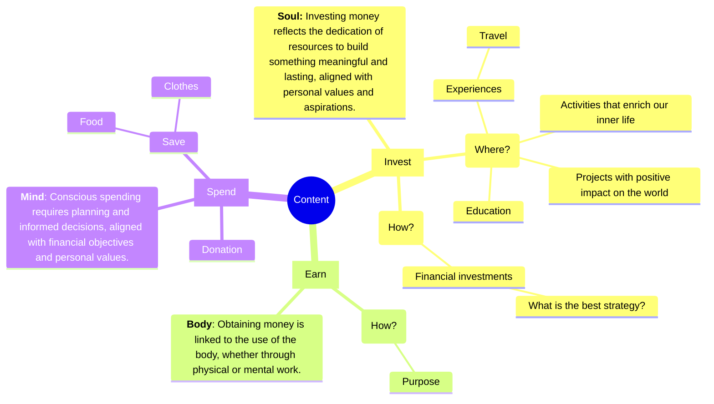
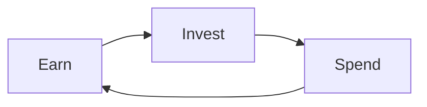

```mermaid
mindmap
  root((Content <br>))
    [Invest]
        **Soul:** Investing money reflects the dedication of resources to build something meaningful and lasting, aligned with personal values and aspirations.
        (Where?)
            Education
            Experiences
                Travel
            Activities that enrich our inner life
            Projects with positive impact on the world
        (How?)
            Financial investments
                What is the best strategy?
    [Earn]
        **Body**: Obtaining money is linked to the use of the body, whether through physical or mental work.
        (How?)
            Purpose
    [Spend]
        **Mind**: Conscious spending requires planning and informed decisions, aligned with financial objectives and personal values.
        Donation
        Save
            Food
            Clothes
```

```mermaid 
graph LR
    Earn --> Invest --> Spend
    Spend --> Earn
```
